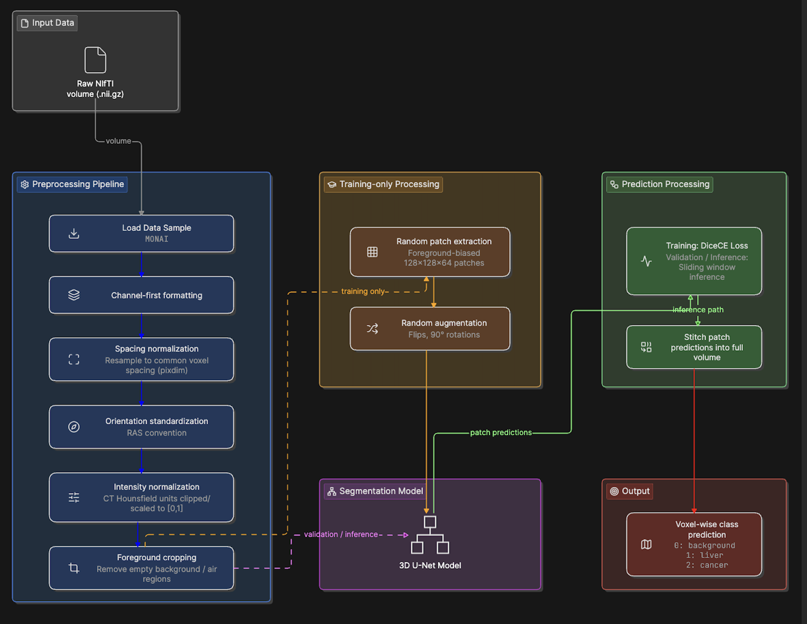
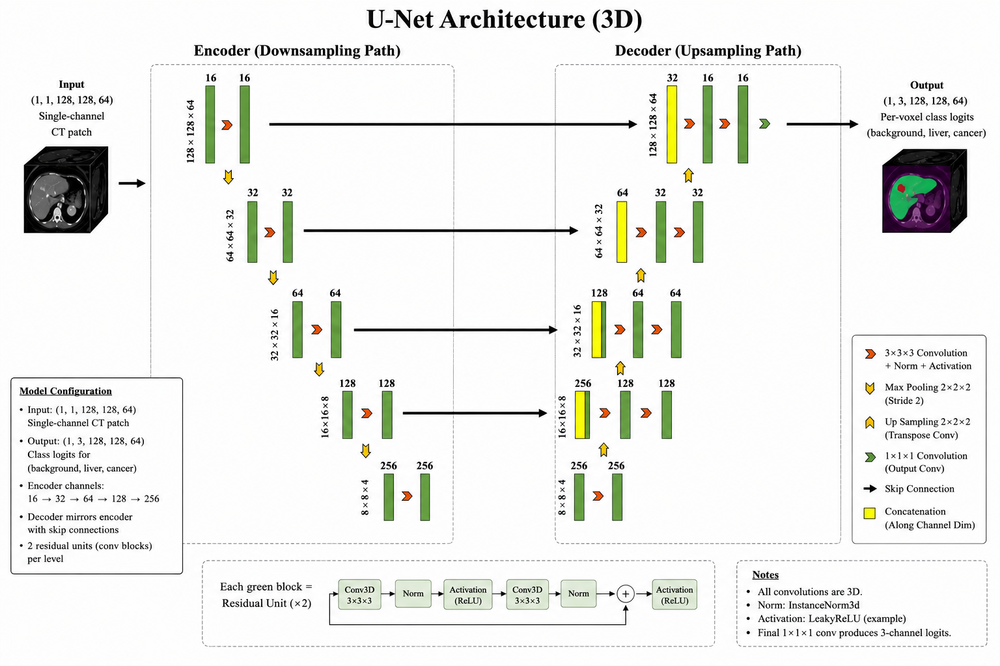

# Liver and Tumor Segmentation from CT Volumes Using 3D U-Net: A Brief Technical Report

## 1. Abstract

This report presents a 3D deep learning pipeline for automated liver and hepatic tumor segmentation from contrast-enhanced CT volumes, built on the Medical Segmentation Decathlon liver dataset. A 3D U-Net architecture was trained to classify each voxel into one of three classes: background, liver, and cancer (tumor). The pipeline includes spacing normalization, foreground cropping, patch-based training with foreground-biased sampling, and sliding-window inference for full-volume evaluation. The model was trained on 50 volumes and validated on 15 volumes using a single fixed split, achieving a mean validation Dice score of 0.837 for the liver class. Tumor segmentation remained substantially more difficult, with a Dice score of 0.0026, reflecting the challenge posed by severe class imbalance and small lesion size. This report documents the technical pipeline,  challenges encountered during development, and directions for improving tumor-level performance.

## 2. Problem Trying to Solve

Manual segmentation of the liver and liver tumors from CT scans is a time-consuming, expert-dependent task that is critical for diagnosis, treatment planning, and monitoring of hepatocellular carcinoma and metastatic liver disease. Automating this process via deep learning can reduce radiologist workload and improve consistency of measurements (e.g., tumor volume tracking over time).

The specific task addressed in this project is **voxel-wise 3D semantic segmentation** of abdominal CT volumes into three classes:

| Label | Class |
|---|---|
| 0 | Background |
| 1 | Liver |
| 2 | Cancer (tumor) |

This is a challenging segmentation problem for two main reasons:

1. **Severe class imbalance.** Background occupies the overwhelming majority of each CT volume; liver occupies a moderate fraction; tumor tissue occupies a very small fraction, often only a few cubic centimeters within a much larger liver volume.
2. **Variable acquisition parameters.** CT volumes in the dataset differ in voxel spacing, slice thickness, and volume dimensions across patients and scanners, requiring careful preprocessing before volumes can be compared or batched together.

## 3. Architecture

### 3.1 Dataset

The [Medical Segmentation Decathlon](http://medicaldecathlon.com/) liver dataset was used, structured per its standard `dataset.json` format, with volumes (`imagesTr`) and voxel-wise labels (`labelsTr`) in NIfTI (`.nii.gz`) format.

| Split | Samples |
|---|---|
| Training | 50 |
| Validation | 15 |
| Split strategy | Single fixed train/validation split (no cross-validation) |

Each volume is a 3D CT scan (modality: CT), paired with a segmentation mask using the three labels described above.

### 3.2 Architecture Overview



### 3.3 Preprocessing Details

**Voxel spacing.** CT scans from different scanners/protocols have non-uniform physical spacing between slices (slice thickness) and within a slice (pixel spacing). All volumes were resampled to a common target spacing (`pixdim`) prior to training, so that one voxel corresponds to the same physical distance across every patient.

Two spacing configurations were empirically compared:

| Configuration | `pixdim` (x, y, z) mm | Liver Dice |
|---|---|---|
| Fine z-spacing | (1.5, 1.5, 1.0) | **0.837** (best) |
| Coarse z-spacing | (1.5, 1.5, 2.0) | Lower (not retained) |

The finer z-spacing (1.0 mm) was retained for the reported results, as it produced a measurably higher liver Dice score than the coarser alternative, despite the additional computational cost of larger resampled volumes.

**Intensity normalization.** CT intensities (Hounsfield units) were clipped to a fixed range and linearly rescaled to `[0, 1]` to standardize input intensity distribution across scans.

**Foreground cropping.** Empty air/background regions surrounding the body were cropped away prior to patch extraction, reducing unnecessary computation on empty voxels.

### 3.4 Patch Extraction and Augmentation (Training Only)

Since 3D volumes are resource intensive, the model was trained on fixed-size 3D patches rather than full volumes.

- **Patch size:** 128 × 128 × 64 voxels
- **Sampling strategy:** Foreground-biased random cropping (positive:negative ratio 1:1), extracting 4 patches per volume per training pass, ensuring the model is regularly exposed to liver and tumor regions despite their relative scarcity within the full volume.
- **Augmentation:** Independent random flips along each spatial axis (probability 0.10 each) and random 90° rotations (probability 0.10), applied after patch extraction to increase effective training diversity given the limited dataset size. Increasing the probability from 0.1 to 0.5 resulted in a lower Dice score (0.787). Therefore, a probability of 0.1 was retained.

### 3.5 Model Architecture — 3D U-Net

A 3D U-Net was implemented using the MONAI framework.




**Loss function.** A combined Dice + Cross-Entropy loss (`DiceCELoss`) was used, with the background channel excluded from the Dice component to prevent the dominant background class from diluting the training signal on the clinically relevant liver and tumor classes. Unlike DiceLoss, DiceCELoss provides stable gradient, preventing vanishing gradient due to lack of foreground(liver or tumor) voxels in training patch. `squared_pred=True` helps convergence in imabalanced dataset.

```python
loss_function = DiceCELoss(
    softmax=True,
    to_onehot_y=True,
    include_background=False,
    squared_pred=True,
)
```

**Evaluation metric.** Segmentation performance was measured using the Dice similarity coefficient, computed both as an overall mean (liver + cancer combined) and per-class (liver and cancer reported separately), to characterize performance on each class independently given their differing difficulty:

```python
dice_metric = DiceMetric(include_background=False, reduction="mean")
dice_metric_per_class = DiceMetric(include_background=False, reduction="mean_batch")
```

**Inference.** Since the model was trained on fixed-size patches but validation/inference required full-volume predictions, sliding-window inference was used to stitch per-patch predictions into a complete volume-level segmentation, using Gaussian-weighted blending in overlapping window regions to reduce edge artifacts.

**Sliding window configuration.**

| Parameter | Value |
|---|---|
| ROI size | 128 × 128 × 64 (matches training patch size) |
| Overlap | 0.1 (reduced from default to decrease inference time) |
| sw_batch_size | 4 |
| Blending mode | Gaussian-weighted/constant |

### 3.6 Training Configuration
The model was trained for a maximum of 100 epochs using the following configuration. Model performance was evaluated at 5-epoch intervals, with a patience of 15 epochs. As no further improvement was observed within the patience period, training was terminated at epoch 45. The checkpoint corresponding to epoch 45 was subsequently used for evaluation.

| Parameter               | Configuration        |
| ----------------------- | -------------------- |
| Maximum epochs          | 100                  |
| Stopping epoch         | 45                   |
| Evaluation interval     | Every 5 epochs       |
| Early-stopping patience | 15 epochs            |
| Batch size              | 1                    |
| Learning rate           | \(1 \times 10^{-5}\) |
| Optimizer               | Adam                 |

### 3.6 System Configuration Table
| Component    | Configuration                           |
| ------------ | --------------------------------------- |
| OS           | Windows 10 Home Single Language, 64-bit |
| CPU          | Intel Core i9-14900HX                   |
| RAM          | 16 GB                                   |
| GPU          | NVIDIA GeForce RTX 4070 Laptop GPU      |
| GPU VRAM     | 8 GB                                    |
| PyTorch      | 2.13.0+cu130                            |
| CUDA runtime | 13.0                                    |


### 3.8 Problems Encountered and Solutions

Several practical engineering challenges arose during pipeline development, summarized below.

| Problem | Cause | Solution |
|---|---|---|
| Manual slice-count truncation lost anatomical structure and reintroduced label-scaling errors on save | Fixed-size slicing (`data[:,:,:min_slices]`) was applied directly to raw NIfTI arrays, requiring manual re-saving of files | Replaced manual cropping with MONAI's dictionary-based dataset/transform pipeline (`LoadImaged` + `RandCropByPosNegLabeld`), which performs correctly-shaped patch sampling on-the-fly  |
| Non-uniform slice counts across patients | Varying CT slice thickness meant equal slice *counts* did not represent equal physical *coverage* | Adopted MONAI's `Spacingd` transform to resample all volumes to a common physical voxel spacing before patch extraction |
| Non-integer label values after resizing | Validation pipeline's `Resized` transform used the default (smooth) interpolation mode on label data instead of nearest-neighbor | Explicitly set `mode=("trilinear", "nearest")` on all transforms |
| Inconsistent patch shapes after switching to coarser voxel spacing | Some volumes, after resampling to coarser spacing, became smaller than the fixed patch size in one dimension | Added `SpatialPadd` to guarantee a minimum volume size before patch cropping, combined with `allow_smaller=True` in the cropping transform |
| Slow full-volume validation (sliding-window inference) | Full CT volumes (up to ~478 voxels in one dimension) required a large number of overlapping sliding windows per validation pass | Reduced window overlap, tuned `sw_batch_size`, and validated at reduced frequency (every N epochs) rather than every epoch to manage computational cost |
| Misleading slice selection during visual inspection | Manual slice-selection logic produced slice index which didn't contain any foreground voxels. Applying sum across raw label class values (0, 1, 2) generated biased selection toward the numerically larger cancer label regardless of actual area | Corrected slice-scoring logic to count foreground pixels via boolean masking, independent of class value |

## 4. Observations

- The preprocessing pipeline, observed on one instance of random transformation, substantially reduced class imbalance by increasing the proportion of liver and tumor voxels relative to total volume, with liver voxels increasing from 2.37% to 18.51% and tumor voxels from 0.12% to 0.66%, while tumor voxels still constituting less than 1% of the training volume.
- The model achieved strong segmentation performance on the **liver** class (Dice ≈ 0.837), even on small number of epochs, indicating that the overall pipeline — spacing normalization, patch-based training, and sliding-window inference — is effective for large, well-defined anatomical structures.
- Tumor (**cancer**) segmentation performance was very poor (Dice ≈ 0.0026), despite foreground-biased patch sampling intended to expose the model to tumor regions more frequently. This is consistent with the known difficulty of small-lesion segmentation under severe class imbalance, and suggests the tumor class requires additional targeted intervention and larger training data beyond what was applied in this iteration.
- Finer z-axis voxel spacing (1.0 mm) outperformed coarser spacing (2.0 mm) for liver segmentation, suggesting that spatial resolution — particularly along the axis most affected by slice thickness variability — has a measurable impact on segmentation quality for this task.

## 5. Conclusion

This project implemented a complete, MONAI-based 3D U-Net pipeline for liver and tumor segmentation from CT volumes, covering data preprocessing, patch-based training with class-imbalance-aware sampling, and full-volume sliding-window inference.

**Final reported metrics** (validation set, single fixed split, 15 volumes, 45 training epochs):

| Class | Dice Score | Voxel Proportion Before Preprocessing | Voxel Proportion After Preprocessing |
|---|---:|---:|---:|
| Foreground (liver + tumor) | 0.5351 | 2.4996% | 19.1826% |
| Liver | **0.837** | 2.3772% | **18.5129%** |
| Tumor | 0.0026 | 0.1224% | 0.6697% |

The results demonstrate that the pipeline is effective for large, anatomically distinct structures (liver), achieving good Dice scores. However, tumor segmentation remains an open problem in this iteration, with and near-zero Dice less than 1 percent training representation, indicating the model largely fails to detect tumor regions.

**Limitations:**
- The training dataset (50 volumes) is small relative to the full Medical Decathlon liver dataset (131 volumes); expanding the training set would likely improve generalization, particularly for the rare tumor class.
- Tumor-specific improvements to explore: increasing the positive-sampling ratio specifically toward tumor-containing patches or applying class-weighted loss terms.
- A single fixed train/validation split was used; k-fold cross-validation would provide a more statistically robust estimate of model performance given the limited dataset size.

---

*GPU: NVIDIA GeForce RTX 4070 Laptop GPU(CUDA). Framework: MONAI (PyTorch-based). Dataset: Medical Segmentation Decathlon, Liver (Task03_Liver).*
